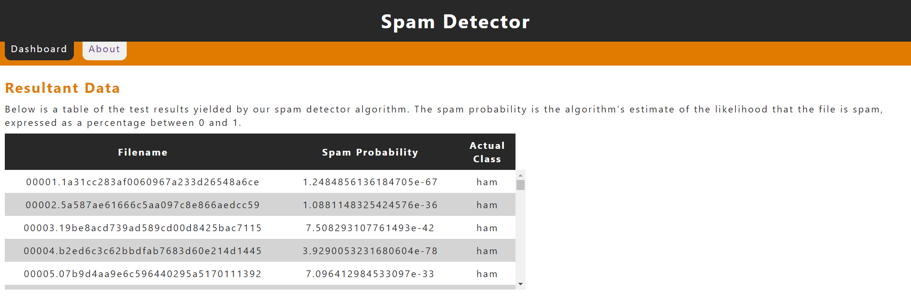
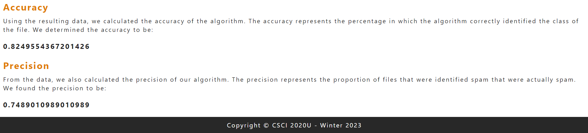
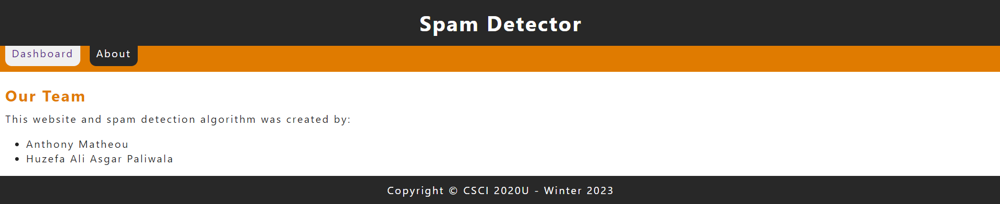

**a\. Project information:**

Group members: Huzefa Ali Agar Paliwala, Anthony Matheou

Student numbers: 100815505, 100828562

Our project is a spam detector application that can distinguish spam
emails from non-spam email. We have trained our model using a dataset of
emails (spam and non-spam) and have calculated probabilities based on
the frequency of each word. We implemented the Naive Bayes algorithm
using the unigram approach to train our program to recognize whether an
email is spam or not. Our application uses a dataset of emails to train
the model, and then it can predict if a new email is spam or not. We
have also developed a simple user interface where the test results are
displayed as well as the accuracy and precision of the algorithm.

Below are screenshots of our application running:

**Figure 1: Resultant Data Section**

&nbsp

**Figure 2: Accuracy and Precision Sections**

&nbsp

**Figure 3: About Page**

&nbsp

Our application achieved an approximate precision and accuracy of 75%
and 82%, respectively.

**b\. Improvements**:

User Interface: We improved on the user interface by improving the
colour scheme and making it match the website icon provided to us in the
template. Furthermore, we changed the UI to be sleeker and easy to
navigate, as well as changing the font stylings to be easy to read.

Model Accuracy: We have improved the accuracy of our model by removing
characters that are not letters from the words, which also ignores
strings that are entirely numbers or entirely punctuation. We also
ensured that the algorithm ignored the "cmds" files which created the
training and testing files.

**c\. How to Run**:

To run our website, follow these steps:

-   Clone the repository from GitHub using git clone.

-   Open the project folder in an IDE such as IntelliJ or Visual Studio
    Code.

-   Install the required packages.

-   Install the required GlassFish server.

-   Turn on the GlassFish server.

-   Deploy the project to GlassFish.

-   Run the website.

-   Once on the website, the data will take some time to appear.

**d\. Other Resources**

No external libraries were used in the improvement of the UI or the
algorithm.
